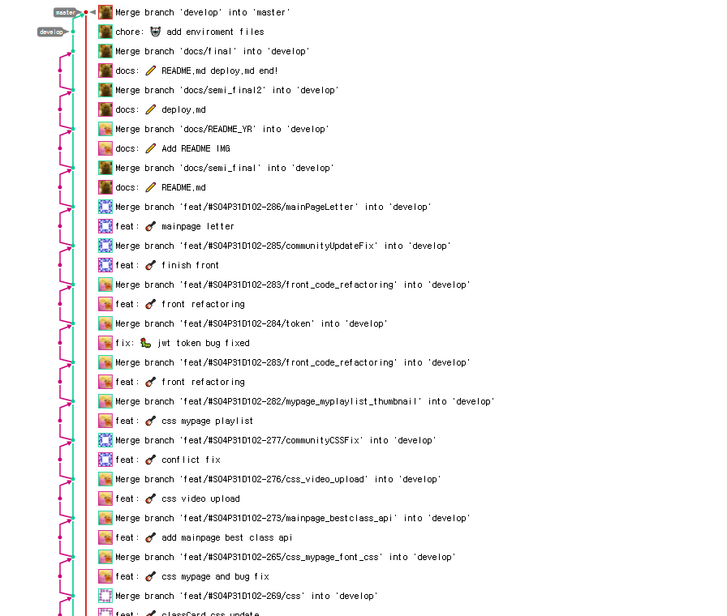

# 태완

## 배운것들

1. 쿠버네티스
2. 동영상 스트리밍 HLS
3. 도커, 쿠버네티스 볼륨
4. JWT
5. 깃 플로우


### 쿠버네티스

<a href="./Gu/쿠버네티스.md">구축정리</a>

구축할 수 있도록 정리는 했지만... 내가 알아보기 편한 정도 나중에 한 번 더 정리예정

또한, 오토힐링, 오토스케일링, 노드 분할, 외부 볼륨 사용 등을 하지 않았기 때문에 좀 더 공부해야 됨.


### 동영상 스트리밍 HLS

m3u8확장자를 가진 파일을 통해 ts확장자를 가진 동영상을 하나씩 불러오는 방식이다.

HTTP 라이브 스트리밍이라고 불리며, 스트리밍 리스폰스 방식으로 m3u8 파일을 불러오며 해당 주소의 패스에 a.m3u8처럼 패스변수로 넣어주면 ts를 자동으로 가져온다.

Fast API 예시)

```python
@router.get("/video/{video}", tags=["video"], description="비디오 불러오기")
def get_video(video: str):
    try:
        video = open(f"{parent_route}/videos/{video}", mode="rb")
    except:
        raise raiseException.Raise_404_Error()
    return StreamingResponse(video, media_type="vnd.apple.mpegurl")
```

저장소를 연결하여 사용하는 방법을 연구해 봐야할 듯 싶다.


### 도커, 쿠버네티스 볼륨

쿠버네티스의 볼륨 네 가지 - 호스트패스, Empty 디렉토리, 퍼시스턴트 볼륨 - 퍼시스턴트 클레임 볼륨, 외부 볼륨

도커 - 호스트와 볼륨 연결(호스트가 메인인 경우와 컨테이너가 메인인 경우로 나뉨)

앞서 말한 듯이, 외부볼륨 연결을 해봐야 할 듯 싶다.


### JWT

음... 이건 헤더, 페이로드, 서명으로 나뉘어 지는것을 확인 했고, HMAC을 통해 인증된다는 것을 알았다.

하지만 좀 더 해보고 싶은 것은 배리어이다.

세션에서 어떻게 배리어로 동작하는지 알고 싶고, 토큰을 로컬스토리지에 저장하는 것이 맞는가도 궁금하다.

좀 더 누군가 설명해줬으면 좋겠지만... JWT에 대해 제대로 알고 있는 사람이 드문 것 같다.

아쉽다.. ㅠㅠ 내가 더 해봐야지 뭐..

배리어에 대해서 한 번 더 해보기!

쿠키랑 세션 같이 사용해 보기!


### 깃 그래프

배달의 민족 깃 플로우를 따라했다.

그래프가.. 이쁘넹^^ ㅋㅋㅋㅋㅋㅋㅋㅋㅋㅋㅋㅋ


