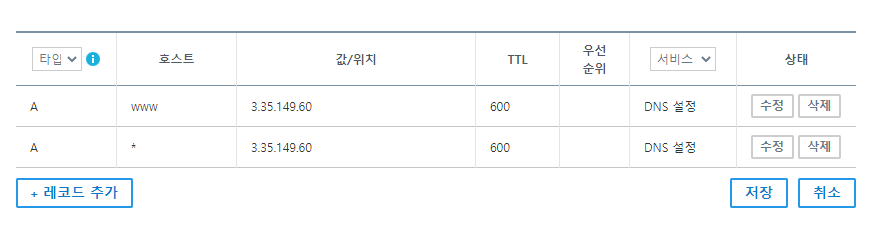
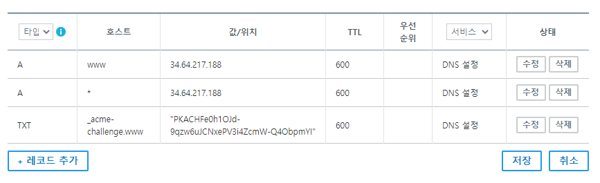
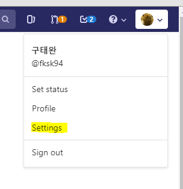
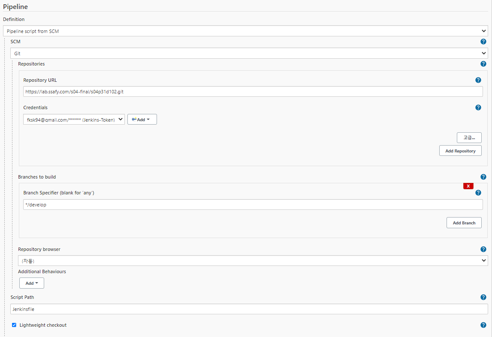
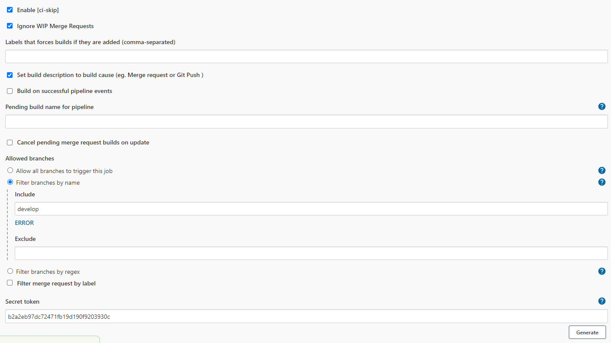
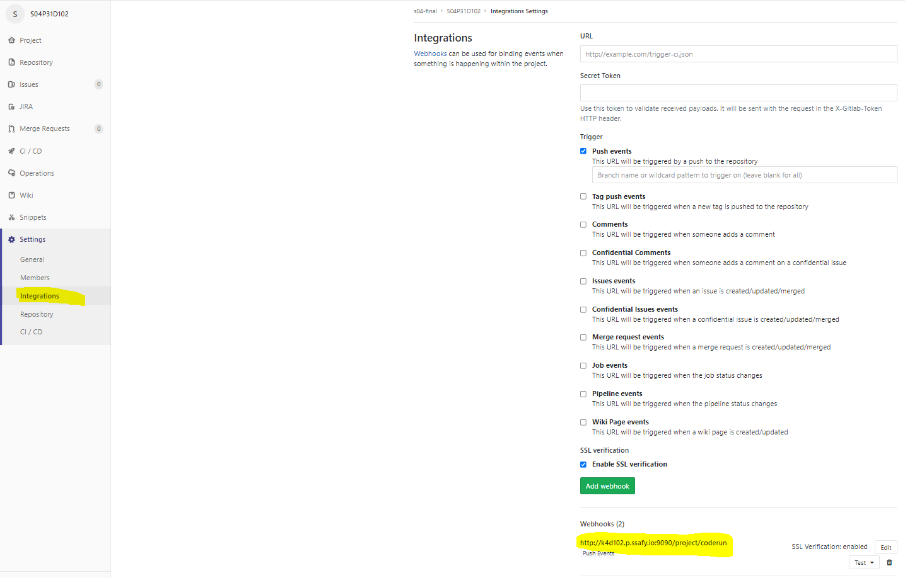
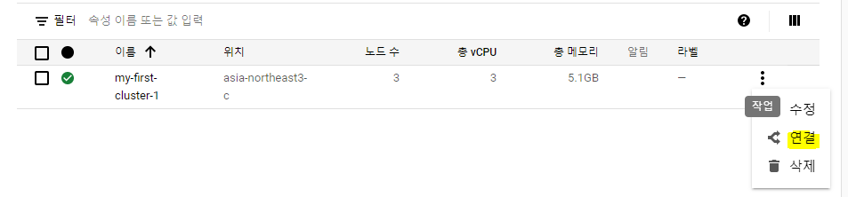
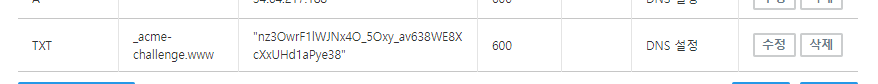

# 배포방법

## 목록

<ul>
    <li><a href="#사전준비">사전준비</a></li>
    <li><a href="#디펜던시">디펜던시</a></li>
    <li>
        <a href="#배포하기">배포하기</a>
        <ul>
            <li><a href="#도메인">도메인</a></li>
    		<li><a href="#AWS">AWS</a></li>
            <li><a href="#GCP">GCP</a></li>
        </ul>
    </li>
</ul>


## 사전준비

* AWS EC2 1대
* GCP 쿠버네티스 클러스터 1대
* 도메인 1~2개
* 환경변수파일(이미지, 비디오, 메인 서버 3개)


## 디펜던시

* python 3.8.5
* fastapi 0.63.0
* node.js 14.17.0
* react 17.0.2
* mysql 8.0.24
* Docker 20.10.6
* k8s 1.18.17-gke.100
* k8s-dashboard 2.0.3 
* Jenkins 2.277.3
  * BlueOcean Plugin 1.24.6
  * Gitlab Plugin 1.5.20
  * Gitlab hook Plugin 1.4.2


## 배포하기

### 도메인

* 원하는 도메인을 구매하여 원하는 기업에서 사용하면 됩니다.

* 저희는 가비아를 썼고, 한 도메인으로 호스트를 다르게하여 2개의 IP를 설정할 수 있는지 늦게 알아서 도메인 2개를 썼습니다.

  * 예시) www.코드런.com(AWS), api.코드런.com(GCP)
  * 실제) www.코드런.com(AWS), www.coderun.shop(GCP)

* 로그인 -> 마이페이지 -> DNS 관리 툴 -> 해당 도메인 선택 -> 레코드 수정

  * IP 주소 아는 법

    * 원래 도메인이 설정되어 있다면 ping을 날려본다. - 현재 프로젝트에서 AWS 주소 확인할 때 사용
    * AWS 자체에서 IP를 확인한다.
    * GCP GKE 자체에서 서비스 외부 IP를 확인한다. - 현재 프로젝트에서 GCP 주소 확인할 때 사용

  * www.코드런.com 설정

    

  * www.coderun.shop 설정

    

* TXT 설정 이유는 HTTPS를 인증하기 위해서 입니다.
  * GCP GKE에서 root 계정으로 못 들어가기 때문에 사이트도메인을 TXT 인증으로 SSL 키를 받아야 합니다.
  * TXT 인증 방법은 GCP 배포에서 다시 다루겠습니다.


### AWS

* 리눅스 시간 설정 `sudo timedatectl set-timezone Asia/Seoul`

* 프로젝트 클론: `git clone https://lab.ssafy.com/s04-final/s04p31d102.git`
* 도커 설치 - 현재 최신버전 20.10.6 -> 프로젝트 버전 20.10.6

```bash
# 필수 패키지 설치
sudo apt-get install apt-transport-https ca-certificates curl gnupg-agent software-properties-common
# GPG Key 인증
curl -fsSL https://download.docker.com/linux/ubuntu/gpg | sudo apt-key add -
# docker repository 등록
sudo add-apt-repository "deb [arch=amd64] https://download.docker.com/linux/ubuntu $(lsb_release -cs) stable"
# 도커 설치
sudo apt-get update && sudo apt-get install docker-ce docker-ce-cli containerd.io
# 시스템 부팅시 도커 시작
sudo systemctl enable docker && service docker start
# 도커 확인
sudo service docker status
```

---

* Mysql 컨테이너 가동 - 현재 8.0.25 최신버전 - 프로젝트버전 8.0.24

```bash
# mysql 이미지 불러오기
sudo docker pull mysql:8.0.24
# 도커 이미지 확인
sudo docker images
# 도커 이름은 --name 뒤에 넣고, password는 root 패스워드(사용자 지정)
sudo docker run -d -p 3306:3306 -e MYSQL_ROOT_PASSWORD=yso486 --name mysql mysql
# 도커 컨테이너 bash 접속
sudo docker exec -it mysql bash
# mysql 접속
mysql -u root -p
# 패스워드 입력
yso486
```

* DB 생성 및 사용자 권한 설정

```mysql
# DB 생성
create database coderun;
# 사용자 생성
CREATE USER 'd102'@'%' IDENTIFIED BY 'yso486';
# 사용자 권한 부여
GRANT ALL PRIVILEGES ON *.* TO 'd102'@'%';
# 권한 새로고침 (해야됨)
flush privileges;
```

---

* 젠킨스 docker-compose.yml 작성

```yaml
services:
  jenkins:
    image: 'jenkinsci/blueocean'
    restart: unless-stopped
    user: root
    privileged: true
    ports:
      - '9090:8080'
    volumes:
      - '/home/ubuntu/docker/jenkins-data:/var/jenkins_home'
      - '/var/run/docker.sock:/var/run/docker.sock'
      - '$HOME:/home'
    container_name: 'jenkins'
```

* 도커 컴포즈 설치 및 젠킨스 블루오션 실행 - 도커 컴포즈 현재 최신 버전 1.29.2 - 프로젝트 버전 1.29.1

```bash
# 도커 컴포즈 설치
sudo curl -L https://github.com/docker/compose/releases/download/1.29.1/docker-compose-`uname -s`-`uname -m` -o /usr/local/bin/docker-compose
# 해당 디렉토리에서 도커 컴포즈 업!
sudo docker-compose up -d
# 실행시킨 도커 컨테이너에 접속
sudo docker exec -it jenkins /bin/bash
# 비밀번호 겟해야함. 젠킨스의 초기 비밀번호로 인터넷상에서 들어갈 수 있음.
cat /var/jenkins_home/secrets/initialAdminPassword
# 이 비밀번호로 http://k4d102.p.ssafy.io:9090 들어갈 수 있음.
```

* 웹(http://k4d102.p.ssafy.io:9090)으로 들어가서 권장 설치 선택

* 아이디 비번 만들고, url에서 next!

* 젠킨스로 들어와진다.

* 플러그인에서 Gitlab Plugin / gitlab hook Plugin 설치

* 설치 후 Gitlab 토큰을 얻어야 됩니다.

  * 깃랩에서 오른쪽 프로필 -> 세팅 -> 액세스토큰 -> 3가지 권한다주고 토큰생성

  

  
  * 생성되면 위의 사진 오른쪽 밑 형광색 줄처럼 만들어집니다.
  * 이 토큰 값은 한번밖에 안보여주기 때문에 어디 저장해놓으시면 됩니다.
  * 다시 젠킨스로 돌아가서 토큰 사용 - 2번 사용할 예정

* jenkins 관리 → 시스템 설정에서 gitlab 관련 설정 추가

  * gitlab api token 입력
  * 젠킨스 로케이션 입력

* ID 및 설명에 그냥 gitlab 토큰 이름 썼습니다.(여기는 원하는 것 쓰면 됩니다.)

* test-connection success 쓴다면 굳!

  


* 메인화면에서 새로운 아이템 선택

* 파이프라인 선택

  * Jenkins pipeline 설정 입력
  * 밑에 보면 SCM -> git 선택
  * Repository URL은 Gitlab Repository URL 입력
  * Credentials는 ADD 한 후 Secret Text 타입으로 변경 후 gitlab id와 위에서 발급받은 token 추가
  * script path는 Jenkinsfile이 git상에 존재하는 폴더 위치

  

* 다시 젠킨스 설정으로가서

  * Build when a change is pushed to Gitlab webhook 체크

  

  * Build Triggers 고급... 클릭 후

  * include에서 webhook 브랜치 선택

  * 우측 아래 Generate 클릭 - 키 생성됩니다.

    

* 이제 깃랩의 설정으로 간다.
  * 프로젝트에서 Settings → Integrations 선택
  * URL은 Build Triggers 설정 시 보였던 Gitlab Webhook URL 입력
  * Secret token은 Build Triggers 설정 시 생성했 던 Secret Token 입력
  * add webhook 후, 푸시 이벤츠해보고 success 확인.

  

* 젠킨스 연결 끝!

---

* 도커 네트워크 설정
  * 네트워크 이름  `coderunnet`으로 설정했습니다.
  * `sudo docker network create coderunnet`
* 리눅스의 이미지 서버 폴더에 들어가서 `.env`파일 작성 및 이미지 도커 컨테이너 따로 실행
  * `cd /s04p31d102/server/image`
  * `docker run -d --name imageserver -v /etc/localtime:/etc/localtime:ro --network coderunnet imageserver:latest`
* 젠킨스로 들어가서 `.env`파일 작성 - 이미지 서버와 같이 메인 서버에 작성
  * `sudo docker exec -it jenkins bash`
  * `cd var/jenkins_home/workspace/coderun/server/main`

---

* HTTPS 설정

  ```bash
  sudo apt-get install letsencrypt
  # 인증서 발급
  sudo letsencrypt certonly --standalone -d www.xn--hy1bk2dh74a.com
  # 이메일 쓰고 Agree
  # 뉴스레터 no
  # 이제 인증서가 발급된다. 이 인증서를 잘보관하자
  # 2가지 키가 발급되는데 이 두가지를 써야한다. 밑의 경로에 각각 하나씩 있다.
   ssl_certificate /etc/letsencrypt/live/www.xn--hy1bk2dh74a.com/fullchain.pem; 
   ssl_certificate_key /etc/letsencrypt/live/www.xn--hy1bk2dh74a.com/privkey.pem; 
  ```

* sslkey 폴더 만들고 `cp` 명령어를 통해 복사. 귀찮다고 폴더를 한번에 복사하게 되면 에러가 나거나 심볼릭링크로 가져오니까 조심!!!

  `cp /etc/letsencrypt/live/www.xn--hy1bk2dh74a.com/fullchain.pem /home/ubuntu/sslkey/`

  `cp /etc/letsencrypt/live/www.xn--hy1bk2dh74a.com/privkey.pem /home/ubuntu/sslkey/`

---

* 이제 develop으로 푸시 해보면 됩니다.

* 주의점: 빌드중 누가 푸시를 하게 되면, 즉, 약 3분 사이에 푸시를 2번하게 되면, 에러가 일어나서 충돌함.
  * 충돌 시, 우분투에서 해당 도커 컨테이너 삭제(jenkins 말고 backend, frontend 같은거)하고 이미지 삭제해준 후 다시 트리거 실행시키거나 푸시하면 해결됩니다.
  * 도커 컨테이너 보는 법
    * `sudo docker ps -a`
  * 도커 컨테이너 삭제
    * `sudo docker rm <container_id>`
  * 도커 이미지 보는 법
    * `sudo docker images`
  * 도커 이미지 삭제
    * `sudo docker rmi <image_id>`


### GCP

#### 클러스터 설치

1. 구글 클라우드 가입 - 무료 크레딧을 300 줍니다.

2. 클러스터로 들어갑니다.

   

3. 만들기를 누르면 표준모드와 Autopilot 모드 설정 가능 - 표준모드 선택

4. 오른쪽에 설정가이드를 보면서 선택 - 더 가용성 높게 설정가능

   * 주의사항 : 영역이나 이름은 우리가 설정해야되므로 설정하면 됩니다.
   * 다만 영역은 asia-northeast3-a,b,c 3개 중 하나 추천
   * 찾아보니까 asia-northeast3가 한국지역
   * 클러스터 설정 - node 1개 - cpu 4코어 / 메모리 16기가

5. 윈도우용 sdk 설치 - https://cloud.google.com/sdk/docs/quickstart-windows

6. 설치 쭉 ~~ next / 설치완료 후

7. 계정 / 프로젝트 / 서버지역 선택하는 것이 나옴 - 우리가 했던 설정을 기입해야 됩니다.

   * 계정은 내 계정하면되고
   * 프로젝트가 어떤 프로젝트일지 모르기때문에 GCP 웹에 들어갑니다.
   * 위에 프로젝트를 선택하면 창이 나옵니다.

   
   * 여기서 내 클러스터 프로젝트의 ID를 보고 그 ID를 선택하면 됩니다.

     

   * 서버지역은 52번이 asia-northeast3와 똑같습니다.

8. 명령어창에서 명령어 입력

   ```sh
   # gcloud 업데이트
   gcloud components update
   # 확인
   gcloud components install kubectl # 치면 All components are up to date 나올 겁니다.
   ```

9. 내 클러스터와 연결

   * GCP의 클러스터에서 연결을 누르기.

     

   * 이거 복사해서 붙여넣기

     

   * 노드 확인 `kubectl get nodes`

10. 대쉬보드 설치

    * 해당 url로 들어가서 맞는 버전확인 - https://github.com/kubernetes/dashboard/releases

    * 1.18버전은 대쉬보드 v2.0.3과 호환

      ```sh
      # 대쉬보드 설치
      kubectl apply -f https://raw.githubusercontent.com/kubernetes/dashboard/v2.0.3/aio/deploy/recommended.yaml
      # 프록시 띄우기
      kubectl proxy
      ```

    * 이젠 url로 접속가능

      http://localhost:8001/api/v1/namespaces/kubernetes-dashboard/services/https:kubernetes-dashboard:/proxy/

11. 사용자 권한 설정

    * 여기서 사용자 권한을 설정 필수.

    * 권한 프리 - **2버전 부터 사라짐**

      * `kubectl -n kube-system edit deployments.apps kubernetes-dashboard`
      * 여기서 스킵하면되지만 2버전 안됩니다!!

    * 권한 설정

    * service-account.yml 작성

      ```yml
      apiVersion: v1
      kind: ServiceAccount
      metadata:
        name: admin-user
        namespace: kube-system
      ```

    * cluster-role-binding.yml 작성

      ```yml
      apiVersion: rbac.authorization.k8s.io/v1
      kind: ClusterRoleBinding
      metadata:
        name: admin-user
      roleRef:
        apiGroup: rbac.authorization.k8s.io
        kind: ClusterRole
        name: cluster-admin
      subjects:
        - kind: ServiceAccount
          name: admin-user
          namespace: kube-system
      ```

    * 명령어 입력

      ```cmd
      # 생성 및 권한 부여
      kubectl create -f service-account.yml
      kubectl create -f cluster-role-binding.yml
      # 유저 확인
      kubectl get sa -n kube-system
      # 계정 토큰 조회 / 해당 경로에서 bash로 켜야 작동함
      kubectl -n kube-system describe secret $(kubectl -n kube-system get secret | grep admin-user | awk '{print $1}')
      ```

    * 이제 토큰으로 대쉬보드 접근하면 됩니다.

#### 프로젝트 잘못 설정시, 프로젝트 변경

```bash
# 프로젝트 리스트 확인
gcloud projects list

# 프로젝트로 변경
gcloud config set project [PROJECT_ID]

# 프로젝트 앱 확인 가능
gcloud app describe
```

#### 도커 허브에 이미지 생성

1. 도커 허브 회원가입

2. 도커 허브 레파지토리 생성

3. 도커 허브에 이미지 올리기

   ```
   docker tag videotest:latest fksk94/video:latest
   docker push fksk94/video:latest
   ```

#### 이미 생성된 이미지로 진행

1. 위의 proxy url로 들어가서 대쉬보드로 진행

2. 파드나 서비스, 컨트롤러 등을 만들 때 여길 누른다.

   

3. 구축 전 hostpath로 폴더 생성

   ```yaml
   apiVersion: v1
   kind: Pod
   metadata:
     name: pod-volume-init
   spec:
     nodeSelector:
       kubernetes.io/hostname: [노드이름]
     containers:
     - name: container
       image: fksk94/video
       volumeMounts:
       - name: host-path
         mountPath: /mount
     volumes:
     - name : host-path
       hostPath:
         path: /var/videos
         type: DirectoryOrCreate
   ```

4. 파드 지우기

5. 퍼시던트 볼륨 01~06 / 총 6개 구축

   ```yaml
   apiVersion: v1
   kind: PersistentVolume
   metadata:
     name: pv-01
   spec:
     capacity:
       storage: 30G
     accessModes:
     - ReadWriteOnce
     local:
       path: /var/videos
     nodeAffinity:
       required:
         nodeSelectorTerms:
         - matchExpressions:
           - {key: kubernetes.io/hostname, operator: In, values: [노드이름]}
   ```

6. 퍼시던트 볼륨 클레임 01~06 / 총 6개 구축

   ```yaml
   apiVersion: v1
   kind: PersistentVolumeClaim
   metadata:
     name: pvc-01
   spec:
     accessModes:
     - ReadWriteOnce
     resources:
       requests:
         storage: 30G
     storageClassName: ""
   ```

7. 파즈 생성 1~6 / 총 6개 구축

   ```yaml
   apiVersion: v1
   kind: Pod
   metadata:
     name: video-server-1
     labels:
       app: video
   spec:
     containers:
     - name: container
       image: fksk94/video
       volumeMounts:
       - name: pvc-pv
         mountPath: /videos
     volumes:
     - name : pvc-pv
       persistentVolumeClaim:
         claimName: pvc-01
   ```

8. 서비스 생성 - 로드 밸런서

   ```yaml
   apiVersion: v1
   kind: Service
   metadata:
     name: svc
   spec:
     selector:
       app: video
     ports:
     - name: http
       protocol: TCP
       port: 80
       targetPort: 80
     - name: https
       protocol: TCP
       port: 443
       targetPort: 443
     type: LoadBalancer
   ```

#### HTTPS 설정

1. 일단 서비스 주소 확인 - 대시보드에서 로드밸런서의 외부아이피를 보면 나온다.

   ```
   status:
     loadBalancer:
       ingress:
         - ip: 34.64.217.188
   ```

2. 인증서 받기 - 도메인 설정할 때 위의 외부 아이피를 넣고 해당 도메인으로 ssl인증

   ```
   #letsencrypt로 받는데 이런게 뜰 수 있다.
   challenge ~~~~~ 
   http://www.coderun.shop/.well-known/acme-challenge/fWcK2kE4GJyuHLznSYLIpckbtuUa7EDyuXPCpU--EuA
   
   # 그럼 이렇게 명령어를 치고
   certbot certonly -d www.coderun.shop --manual --preferred-challenges dns
   # 이런 텍스트가 나오면 복사하면된다.
   nz3OwrF1lWJNx4O_5Oxy_av638WE8XcXxUHd1aPye38
   # 밑처럼 설정 (가비아)
   ```

   


4. 확인

   ```
   # 다른 배쉬창에서
   nslookup -q=TXT _acme-challenge.www.coderun.shop
   # 확인 후, 진행 창에서 진행
   ```

   ```
   그러면 풀체인과 프라이빗키가 생긴다 이걸 쓰면 SSL 인증이 가능하다.
   ```

5. 이걸 인증할 때 새로운 도메인을 쓰게 된다면, 풀체인키와 프라이빗키로 비디오 서버를 도커허브에 새로 올려야한다. 새로 올릴 때 ssl 키와 동봉된 .env파일을 추가 후, 위의 사항을 진행하면 새로운 도메인으로도 가능하다.
6. ※제일 중요※ nginx와 fastapi 컨테이너를 합쳐서 대시보드에서 각 파즈에서 `service nginx restart`라고 한번씩 쳐주면 된다.
7. 합치지 않을 거라면, GKE 자체의 nginx설정을 쓰거나 각각 컨테이너를 따로해서 파즈를 생성하면 된다.

