

    <h3 align="center">AI/ML End to End Block Coding Education</h3>

    

        <a href="./docs/README.md">View Demo</a>
    

  
Table of Contents

  <ol>
    <li>
      <a href="#flanet이란">FlaNET이란?</a>
      <ul>
        <li><a href="#기획-배경-및-전망"> 기획 배경 및 전망 </a></li>
        <li><a href="#기술-스택"> 기술 스택 </a></li>
        <li><a href="#DB-설계"> DB 설계 </a></li>
        <li><a href="#인프라-구조"> 인프라 구조 </a></li>
      </ul>
    </li>
    <li>
      <a href="#시작-방법">시작 방법</a>
      <ul>
        <li><a href="#사전-설치">사전 설치</a></li>
        <li><a href="#준비하기">준비하기</a></li>
        <li><a href="#실행하기">실행하기</a></li>
        <li><a href="#배포하기">배포하기</a></li>
      </ul>
    </li>
    <li><a href="#튜토리얼">튜토리얼</a></li>
    <li><a href="#팀-구성-및-소개">팀 구성 및 소개</a></li>
    <li><a href="#그-밖에...">그 밖에...</a>
      <ul>
        <li><a href="#로고"> 로고 </a></li>
        <li><a href="#PPT"> PPT </a></li>
        <li><a href="#동영상"> 동영상 </a></li>
      </ul>
    </li>
  </ol>

# FlaNET : AI/ML 블록코딩 교육 서비스

## FlaNET이란?

시계열 데이터를 활용한 교육용 AI / Machine Learning 블록 코딩 서비스

※ 시계열 데이터 : 금융 데이터 및 기온 데이터

### 기획 배경 및 전망

* 기술/트렌드 동향

   4차 산업의 발달에 따라 AI와 Machine Learning은 모든 산업분야에서 혁신을 선도하는 기반 기술로써 세계 각국에서 사회 전 분야에 걸쳐 급속하게 발달되고 적용되고 있다. 그러나 Machine Learning은 기존 소프트웨어 기술과는 다른 점이 많아 개발자들은 공부하기가 상대적으로 쉽지 않고, 기업들은 여전히 관련 인력 채용에 어려움을 겪고 있다. 국내 AI 분야 인력 수급 격차가 점차 벌어져 2022년에는 약 1 만 명이 부족할 것으로 예상된다.

* 국내/외 현황

   과학기술정보통신부가 2021년 인공지능(AI) 관련 분야에만 전체 예산 중 13%에 달하는 예산을 투입하고 미래 먹거리로 AI를 정조준 했다. 또한, 시대변화에 맞춰 AI 혁신 인재 양성을 위한 교육에도 관심이 커지고 있다. 2025년부터 적용되는 초·중·고 새 교육과정에 AI 교육이 정식으로 도입되고, 현재 전국 8곳인 AI (인공지능) 대학원이 2021년 2곳 더 신설된다. 이를 통해 AI 생태계를 조성하고 중장기적으로 대규모 AI 인력을 양성하기 위한 정책을 추진하고 있다.

   가트너는 2021년을 선도할 주요 IT 기술로 AI Engineering을 선정했다. AI는 점점 보편화되어 2021년까지 서비스 제공 업체가 구현하는 새로운 엔터프라이즈 애플리케이션의 40%에 AI 기술이 포함될 것으로 예상한다. 뿐만 아니라, 딜로이트 리포트에 따르면 74% 의 기업 임원들은 AI가 “모든 기업의 어플리케이션”에 3년(2023년) 이내에 포함될 것으로 바라보고 있다.

* 벤치마킹 또는 유사 서비스 사례 소개

  * Machine Learning for Kids (https://machinelearningforkids.co.uk/)
  * Teachable Machine (https://teachablemachine.withgoogle.com/)
  * 로보 어드바이저 (Robo-Advisor)

* 소비자/시장에 줄 수 있는 가치

   AI / Machine Learning 기술을 쉽고 간단한 블록 코딩으로 제공하여 관련 지식이 없는 사람들도 진입장벽 없이 AI / Machine Learning을 학습할 수 있다. 블록 코딩으로 수행된 내용을 실제 코드와 시각화된 자료로 제공하여 프로그래밍 언어뿐만 아니라 심화된 AI / Machine Learning 지식을 함께 얻을 수 있다.

  사람들이 흥미롭게 생각하는 요소인 다양한 금융 데이터를 활용하여 보다 친숙하게 AI / Machine Learning 기법을 접할 수 있으며, 해당 데이터에 대한 분석 결과를 대시보드 형태로 제공하여 본인이 설계한 모델의 정확도를 검토하고 금융 데이터의 흐름을 파악할 수 있다. 더 나아가 사용자가 직접 금융 데이터를 커스텀하고 분석 모델을 설계하여 AI / Machine Learning 기법이 어떻게 적용되어 결과가 추출되는지 쉽게 학습할 수 있다.

* 향후 전망

   4차 산업에 핵심적인 기술인 AI / Machine Learning을 누구나 쉽게 경험해보며 단계별로 어떻게 나누어지고 동작하는지 관련 배경지식을 쌓을 수 있어 4차 산업 관련 직무의 진입장벽이 낮아지는 것을 기대할 수 있다. 추후 서비스 확대 시, 시계열 데이터에 한정되는 것만이 아니라 사용자가 원하는 모든 데이터를 통해 AI / Machine Learning 기법을 쉽게 학습할 수 있다.

  

### 기술 스택

### DB 설계

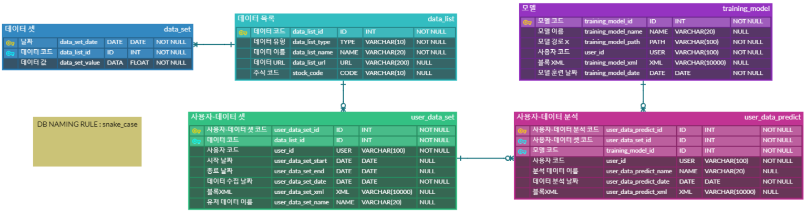

### 인프라 구조

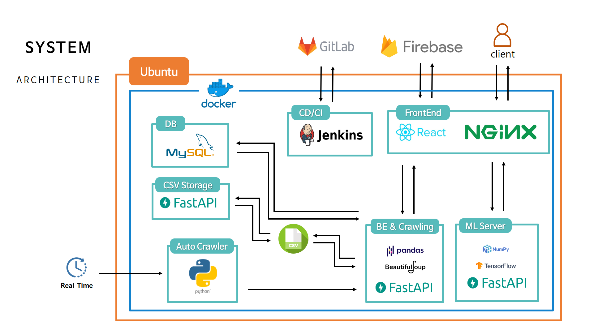

## 시작 방법

### 사전 설치

> 프로젝트를 정상적으로 실행하기 위해선 아래 프로그램들이 설치되어 있어야 합니다

- node.js 14.15.0
- python 3.8.5
- react  17.0.1
- npm 6.14.8
- mysql 8.0.23
- fastapi 0.63.0

### 준비하기

1. Git clone 받기

2. 백엔드 가상환경 설정

   `pip install -r requirements.txt` 

3. 프론트엔드 필요 패키지 설치

   `npm i`

4. `.env`파일 작성 (위 프로젝트에는 env파일이 삭제되어 있습니다.)

### 실행하기

1. 백엔드 실행

   로컬에서 하기 위해서는 python main.py로 실행

   도커 실행은 `docker run 옵션`을 통해 실행

2. 프론트엔드 실행

   로컬에서 실행은 `npm start`

   도커는 build 후 빌드 파일을 `docker run 옵션`을 통해 실행

※ 둘 다 도커파일은 작성되어 있습니다.

### 배포하기

해당 서비스는 AWS EC2를 통해 배포하였고
Docker와 Jenkins를 이용해 CI/CD 구축하였습니다:

1. AWS EC2 인스턴스 생성 (ubuntu)
2. docker 설치
3. 필요한 이미지를 docker hub를 통해 이미지 설치 및 컨테이너 생성
   1. Jenkins
   2. MySQL
4. Jenkins와 Gitlab repository 연동
5. 각 폴더 안에 dockerfile 작성
6. fileserver를 도커 네트워크를 통해 생성
7. auto crawler 컨테이너 생성
8. Nginx 설정 (frontend/nginx 폴더의 homepage.conf)
   * fileserver, mlserver, frontend, backend를 nginx로 연결
9. 프로젝트 root 위치에 Jenkins 파일 작성
   1. Build and Test 과정
   2. Build (frontend, backend, mlserver)
   3. Run (컨테이너 실행)
10. `docker ps` 를 통해 7개의 컨테이너 잘 실행되는 것을 확인

## 튜토리얼

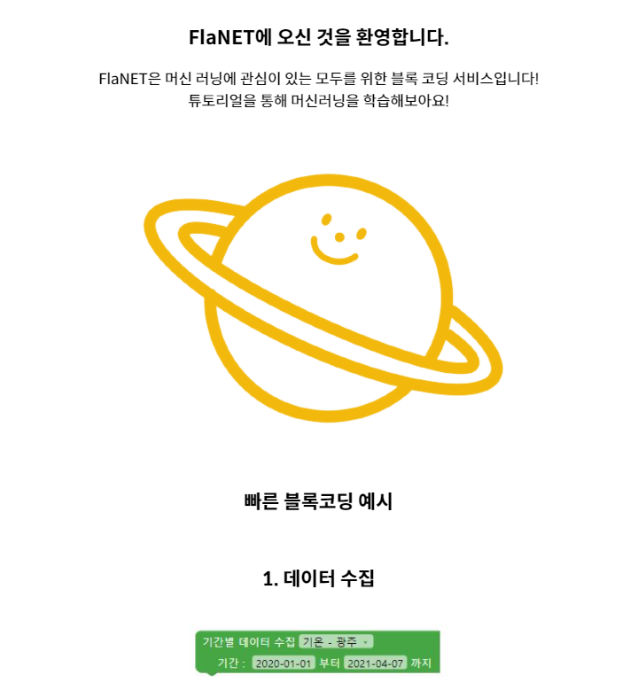

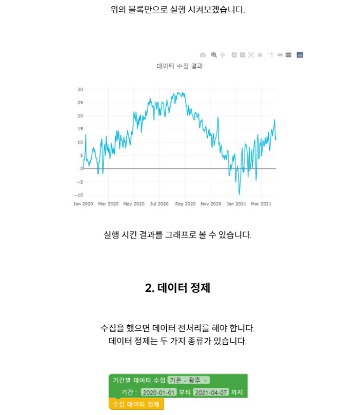

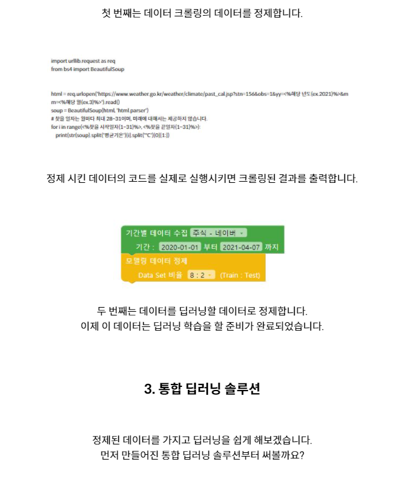

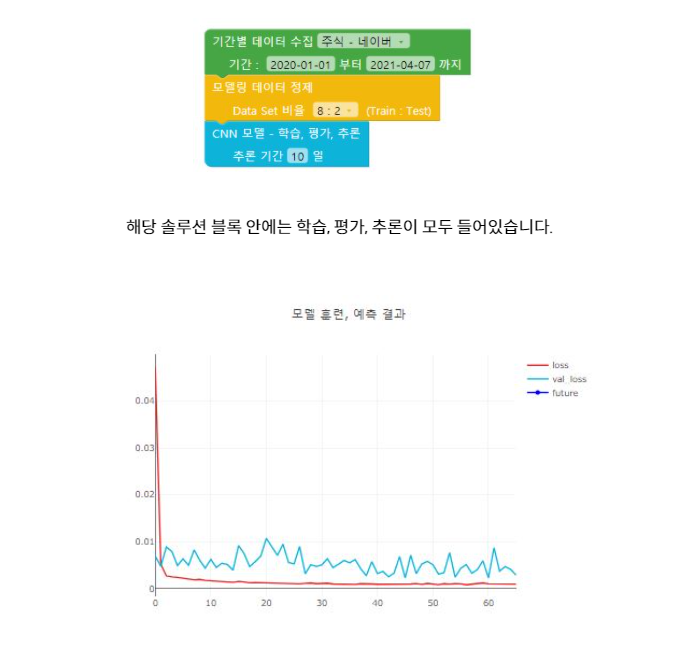

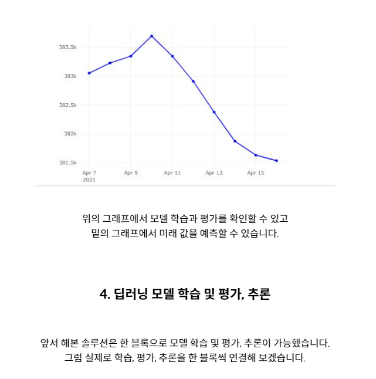

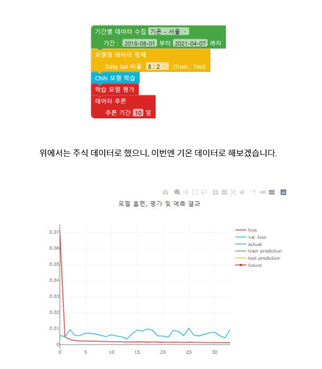

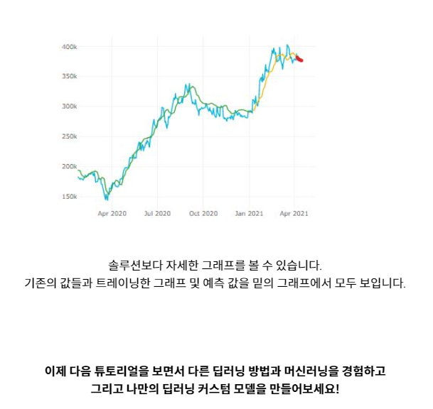

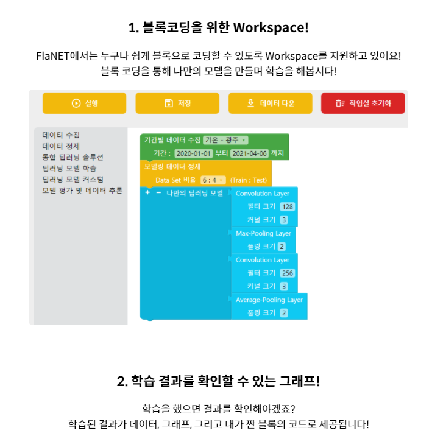

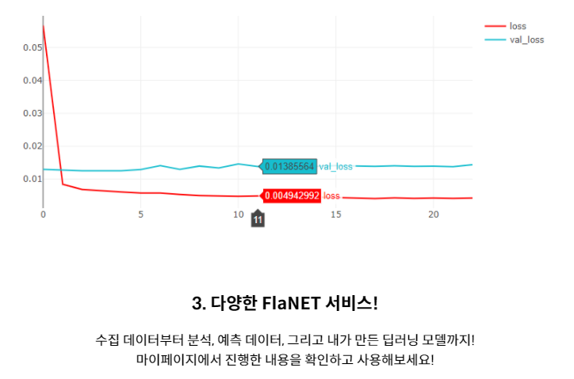

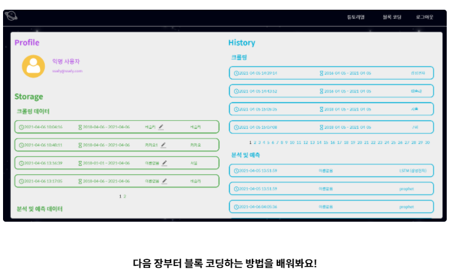

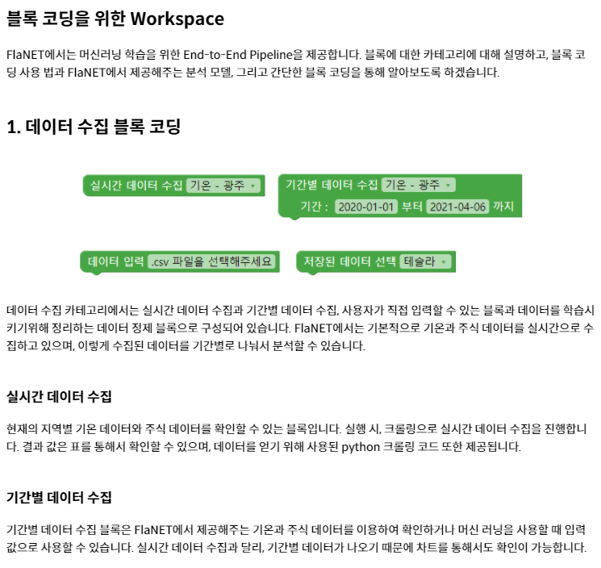

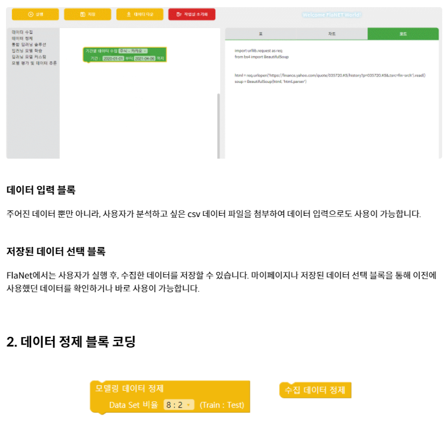

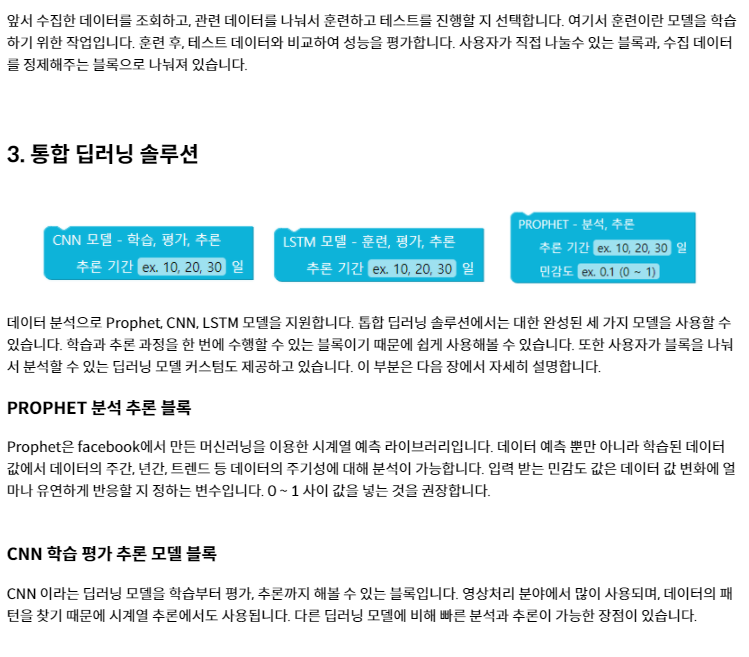

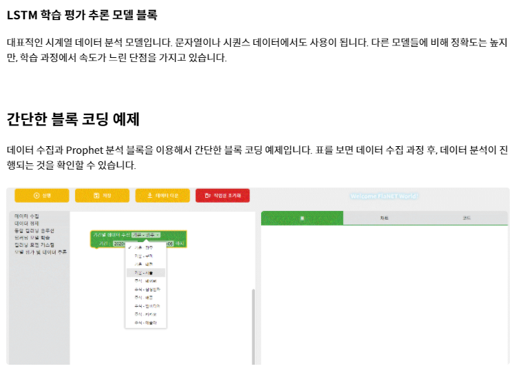

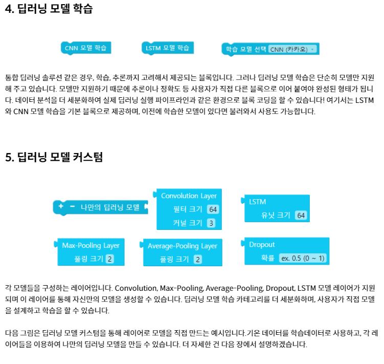

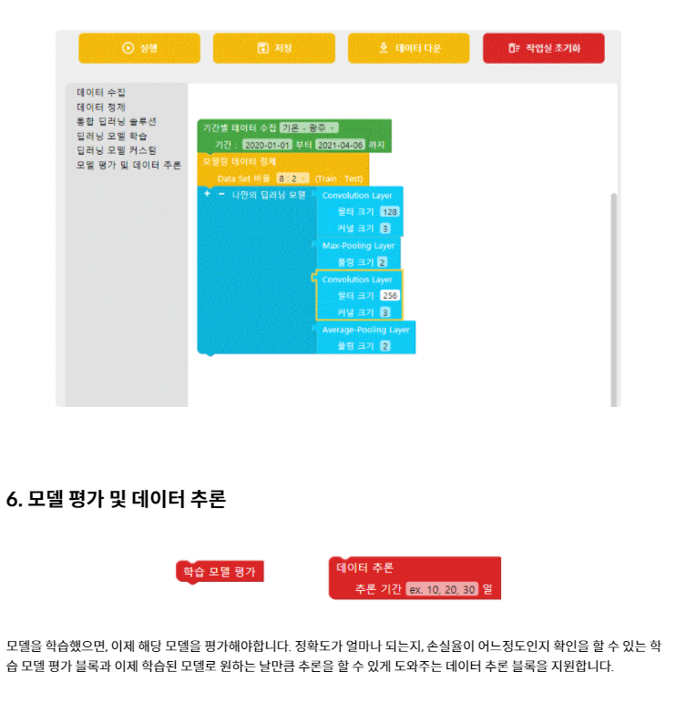

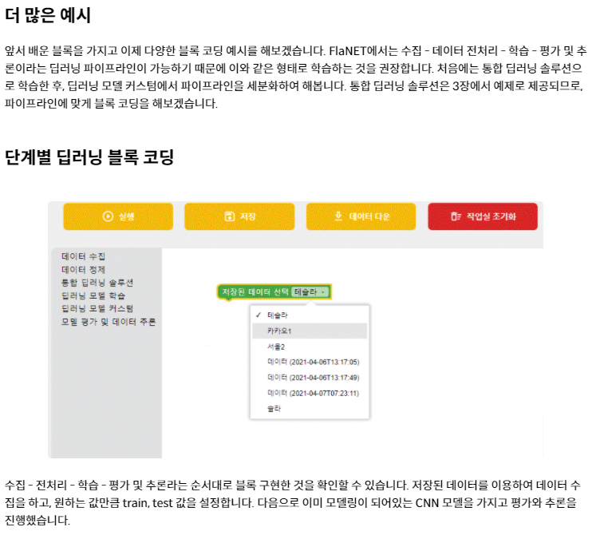

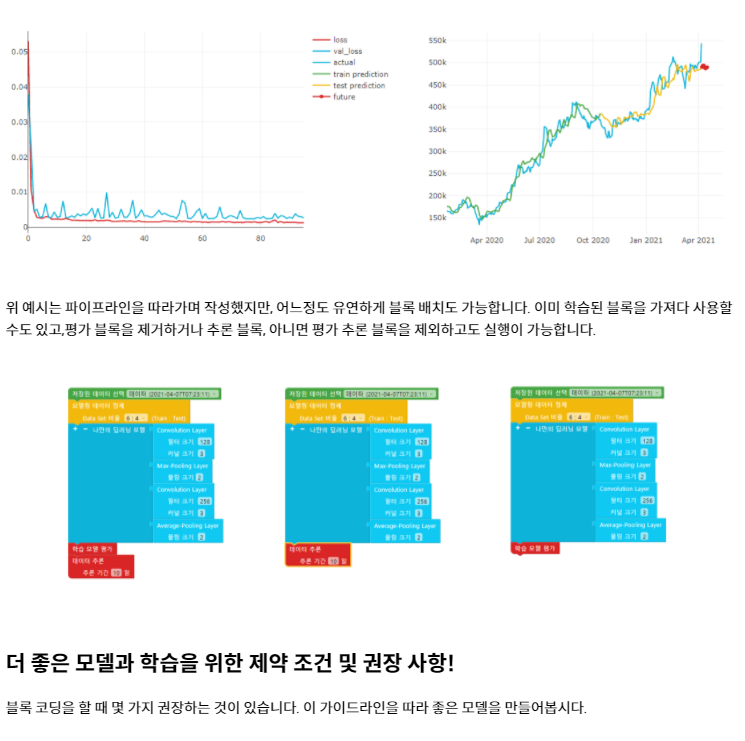

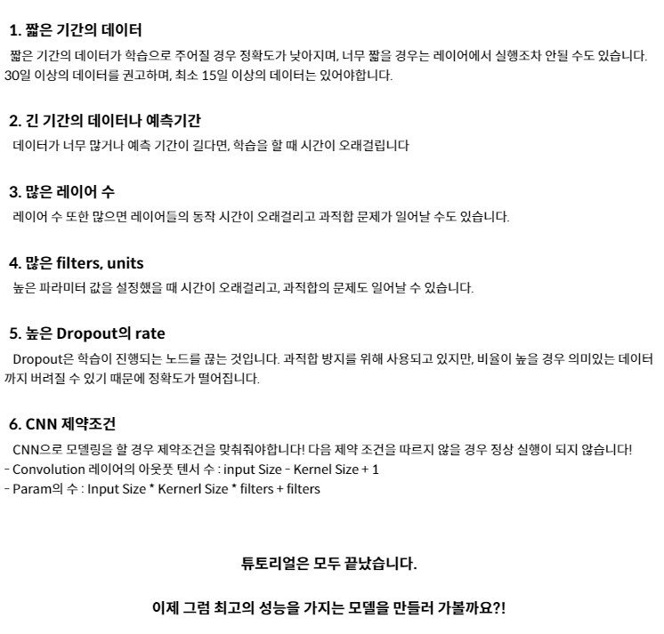

## 팀 구성 및 소개

Field + Planet + Network = 삼성전자 네트워크사업부와 함께하는 필드프로젝트 행성에 착지한 우리

## 그 밖에...

### 로고

### ppt

    <a href="./docs/중간 발표.pptx">중간 발표</a>

    <a href="./docs/최종 발표.pdf">최종 발표 PDF</a>

    <a href="./docs/최종 발표.pptx">최종 발표 PPT</a>

### 동영상

    <a href="https://youtu.be/OJfp0IxcjhM"> 30초 소개 영상 </a>

