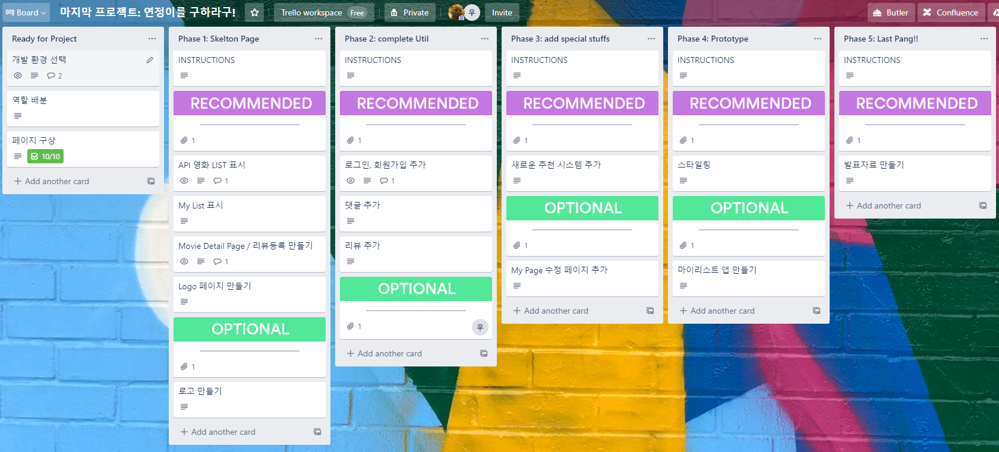
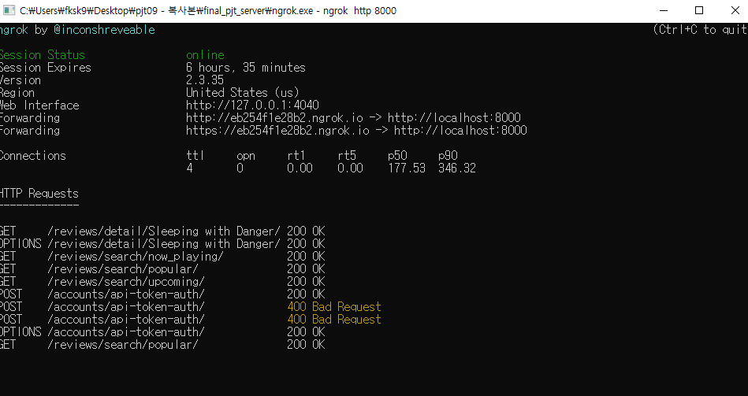
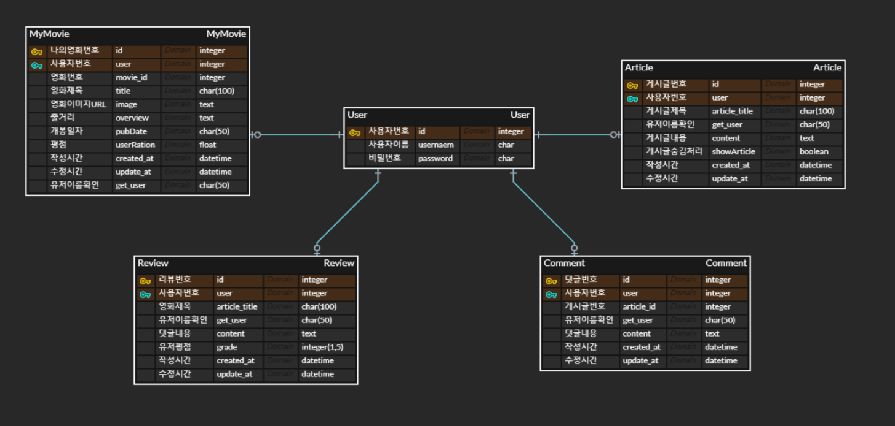
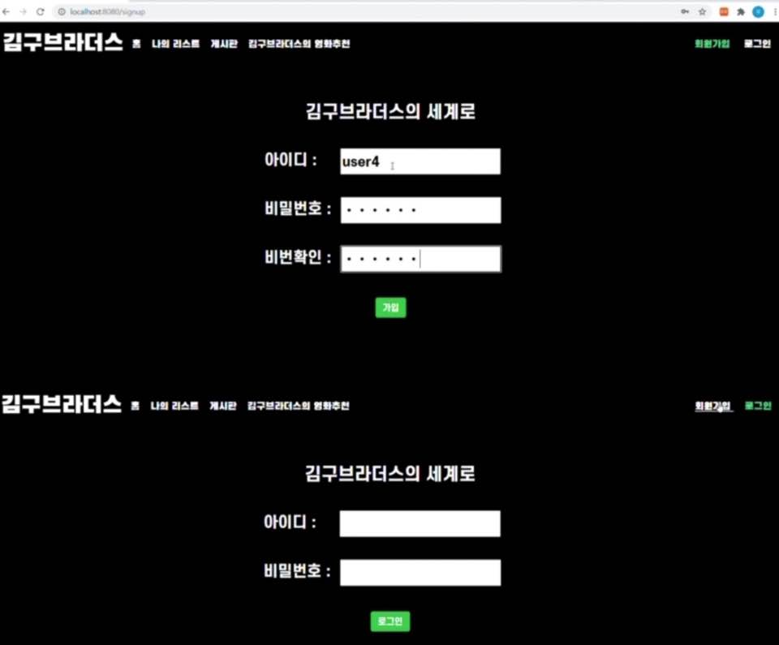
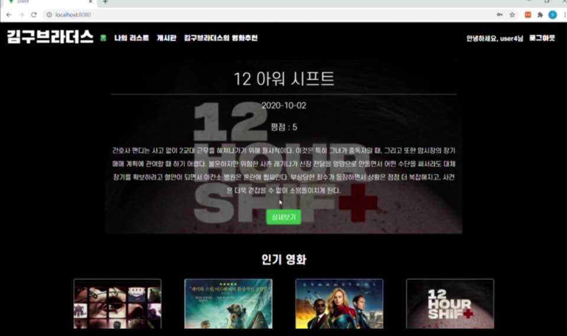
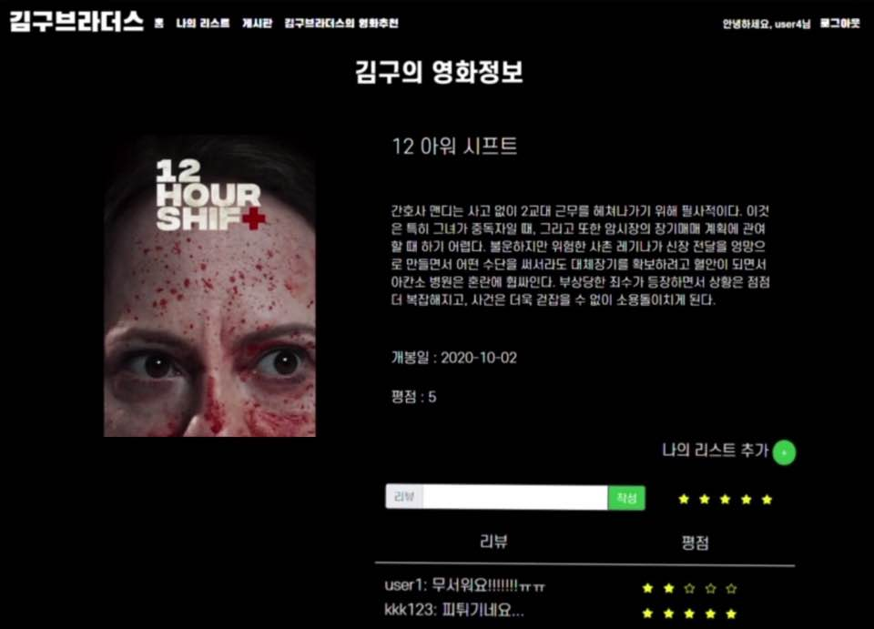
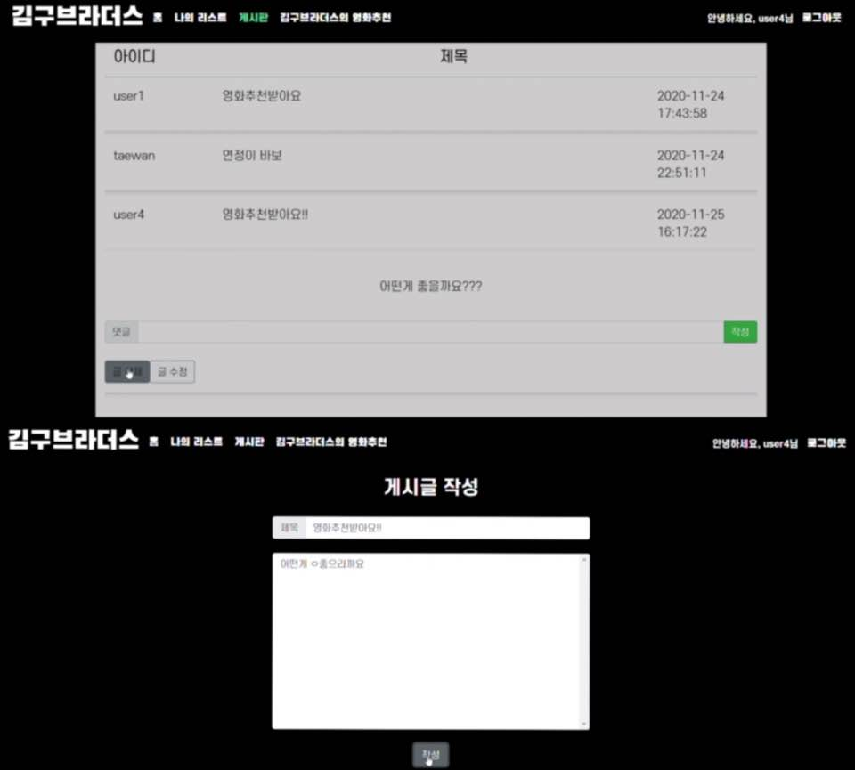
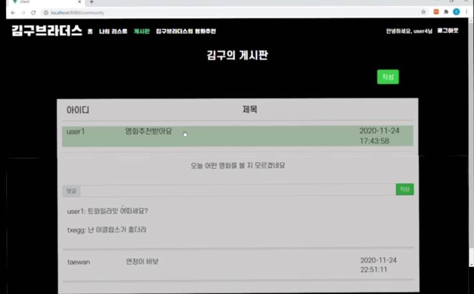
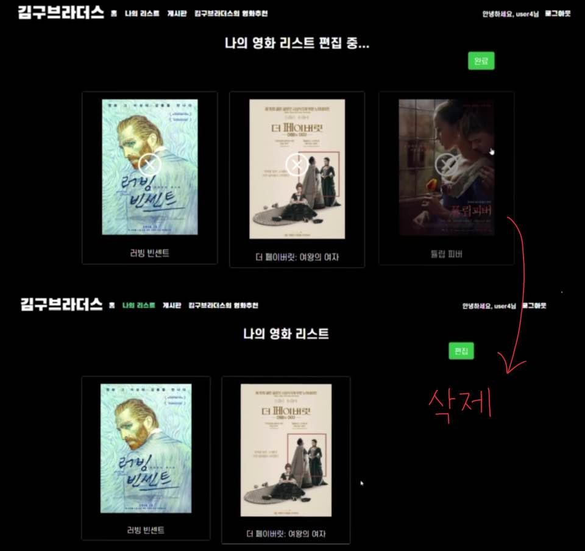
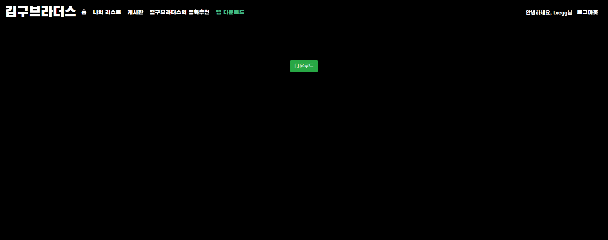

# 김구브라더스

### 팀명 : 연정이를 구하라구!

### 팀명의 유래

* 김연정과 구태완의 성을 따서 워너 브라더스를 오마주했습니다.

### 배포 URL

netlify와 Heroku 사용

## INDEX

[1. 프로젝트 - 준비](#준비)

[2. 프로젝트 - 개요](#개요)

[3. 프로젝트 - 프론트엔드](#프론트엔드(Vue))

[4. 프로젝트 - 후기](#후기)

## 준비

### 목표 - 영화추천사이트

1. 영화 정보 기반 추천 서비스 구성
2. 커뮤니티 서비스 구성
3. HTML, CSS, JavaScript, Vue.js, Django, REST API, DataBase 등을 활용한 실제 서비스 설계
4. 서비스 관리 및 유지보수
5. 추가 목표
   * 영화 추천 알고리즘 여러개 추가
   * 유저마다의 나의 영화 리스트 소유
   * 각 유저의 영화 리스트 앱 연동

### 개발환경

1. 언어
   * python 3.8.5
   * Django 3.1.3
   * Node 14.15.0
   * vue.js 2.6.12
   * react-native "https://github.com/expo/react-native/archive/sdk-39.0.4.tar.gz"
2. 도구
   * vsCode
   * Chrome Browser
   * ngrok
   * Trello
   * Eetro Bundler
   * Expo
   * Firebase
3. 아키텍처
   * DRF 서버 & Vue.js

## 개요

### 역할 배분

* 팀장 구태완 : 백엔드(Django), 프론트엔드(Vue), 앱(RN), 영상제작
* 팀원 김연정 : 백엔드(Django), 프론트엔드(Vue), 영상제작, 발표자료 제작

### Trello

* 계획 및 Todo List 활용

### ngrok

* Vue(프론트)와 Django(백)을 나누어서 진행
* ngrok로 장고 서버를 켜서 프론트에서 확인

### ERD

* 모델링 시, article과 comment에 foriegn key를 주지 않은 이유는 vue에서 이미 받아오기 때문에 연결시키지 않고 바로 번호로 filtering 하였습니다.

### 기본 서비스

* 회원가입
  * 회원 가입은 비밀번호 확인을 통해 가입진행
  * 아이디 중복시 회원가입 불가능
* 로그인
  * jwt를 활용하여 로그인
  * 로그인 시, 토큰과 유저 네임을 LocalStorage에 저장하여 사용
  * 홈 화면 빼고 모든 컨텐츠는 로그인 시 사용가능

* 홈 화면
  * 홈 화면에는 인기 / 개봉예정 / 현재상영 영화 각 20개씩 60개가 뜸.
  * 계속 받아오게 만들어 놓았으므로 기본 디폴트 값이 있는 것이 아니라 TMDB를 통해 바로 가져옴.
  * 프로젝트 이후에도 계속 사용가능
  * 밑의 영화 포스터를 클릭시 간략 상세보기가 뜨며, 상세보기 페이지로 이동가능

* 상세보기
  * 영화의 상세정보를 표시
  * 영화를 나의 리스트에 추가 가능
  * 리뷰와 평점을 작성 가능

* 커뮤니티

  * 스타일 때문에 게시글만 생성시간을 표현
  * 게시글 생성, 수정 및 삭제 가능

  

  

  * 댓글 생성 및 삭제 가능

  

* 추천 알고리즘
  * SSAFY 사람들의 추천 영화를 데이터로 추천
    * 현재 5개의 영화 출력가능
  * 김의 추천 영화
    * 사용자의 "나의 리스트" 안에 영화가 있어야 가능
    * 사용자의 영화와 비슷한 영화를 받아옴.
    * TMDB의 similar API를 사용하였고 그 영화들의 10페이지(200개) 중 하나의 영화를 추천
  * 구의 추천 영화
    * 지금 유명한 20000개의 영화 중 하나를 추천
    * 랜덤 페이지 하나를 선택하여 20개 중 하나를 랜덤으로 추천
  * 2개의 추가 추천을 진행함

* 나의 리스트
  * 나의 리스트에 추가된 영화를 삭제 가능
  * 삭제 시, 편집을 눌러 들어간다. X 표시가 뜨며, 누르면 삭제가능
  * 삭제가 끝나면 완료를 눌러 나의 리스트로 돌아감
  * 나의 리스트의 영화를 누르면 영화 상세보기로 이동

* 추가 앱
  * RN를 사용하여 앱을 만들었고 나의 리스트에 추가된 것을 앱에서 볼 수 있다.
  * 앱 사용법
    * 앱 다운로드
    * 사용자 ID를 입력하면 나의 리스트 출력
    * 안드로이드만 빌드. IOS는 맥북있으면 가능
    
    

## 프론트엔드(Vue)

* Vue는 Django만 연결한다.
* LocalStorage를 이용하여 영화 상세보기를 굳이 DB에 저장하지 않아도 볼 수 있게 만들었다.
  * 상세보기에서 한 번 봤던 영화를 DB에 저장하지 않으므로 DB 효율에 있어서는 큰 장점이다.
  * 리뷰는 따로 저장하기 때문에  영화를 굳이 저장하지 않아도 된다.
* Axios 요청을 통해 페이지 새로고침을 하지 않아도 페이지에서 서버로 요청과 데이터 변경이 가능하다.
* 로그인 시, jwt와 username을 LocalStorage에 저장하여 로그인한 것을 확인한다.
* 스타일링
  * CSS, BootStrap, Animate, VueBootStrap을 이용하였다.
  * hover 이펙트가 좀 처럼 생각대로 작동 되지 않아서 힘들었다.
  * 😋container😋
    * 질문 : 반응형 브라우저를 만들려고 애쓰다 보니 container를 사용해서 어려웠지이~~?
    * 답변 : 아닝~~ 많이 알게된 시간이었어. 이런 페어 프로젝트 또 하고 싶당~~!!
  * 한 눈에 들어올 수 있는 디자인을 만들려고 많이 고민했다.
  * 추천 알고리즘 디자인을 만드는 것이 힘들지만 재밌었다.
  * "싸피인들의 추천 영화" 디자인은 한땀한땀 우리가 만들었똬아..... ㅎㅎㅎ
  * 앱 로고와 사이트 로고 구상도 너무 재밌는 과정이었다.

## 후기

#### 태완이의 후기😁

 프로젝트를 벌써 3번이나 같이한 페어와 함께 해서 충돌도 없고 서로 잘 이해하며 재밌게 프로젝트를 끌어나가서 너무 좋았습니다. 연정이의 해피한 성격때문에 팀 프로젝트하면서 잠도 많이 못 자고 주말도 없이 진행했지만 매일 잠을 한 하루에 20시간 잔듯한 상쾌한 기분이었습니다.

 백엔드와 프론트엔드 둘 다 접하면서 많이 배운 것 같습니다. 특히 Axios와 container 쪽은 마스터한 느낌이에요 ㅎㅎ API도 이제 다른 것들 보면서 많이 쓸 수 있을 것 같고, Key 숨기는 방법도 다양한 것을 알아냈습니다. 배포도 해보면서 제가 진짜 현업 개발자가 된 것 같아 기분도 좋았고, PPT에, 영상에, 웹, APP, 배포까지 성취감이.. 진짜 엄청 난 것 같습니다. 또, 좋은 프로젝트 포트폴리오도 만든 것 같아 기분이 좋습니다.

#### 연정이의 후기🥰

 싸피 기간동안 프로젝트를 몇 번 해봤지만, 일주일의 기간동안 진행해본 적은 처음이여서 새롭고 재밌었습니다!!! 🤗🤗🤗

완성된 웹 사이트를 만드는 과정에서 아이디어와 시나리오를 구상하면서 사용자의 관점으로 생각했고, Vue.js로 프레임워크를 만들면서 개발자의 관점에서 웹을 생각할 수 있었습니다.

7일동안 팀원과 함께 코드를 짜고, 의견을 주고 받으면서 협업을 배울 수 있었습니다.

협업을 하면서 중요하다고 느꼈던 커뮤니케이션은 크게 세가지라고 생각합니다

1. 서로 소통하면서 의견의 본질을 파악하기
2. 타인의 감정을 공감하는 능력
3. 나의 주장을 상대가 이해할 수 있도록 전달하는 능력

구상한 아이디어를 실현할 수 있는 코딩실력과 협업을 원만하게 진행할 수 있는 소통능력을 기를 수 있었다는 점이 최종 프로젝트에서 가장 크게 얻은 점이라고 생각합니다!!

