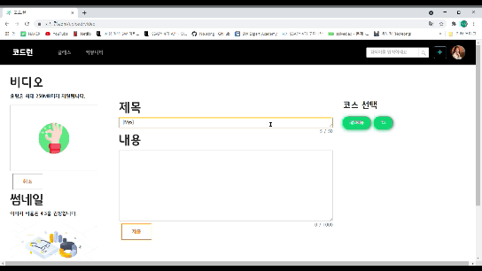
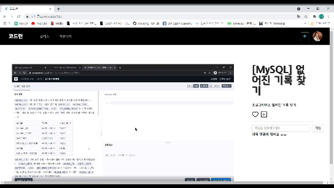
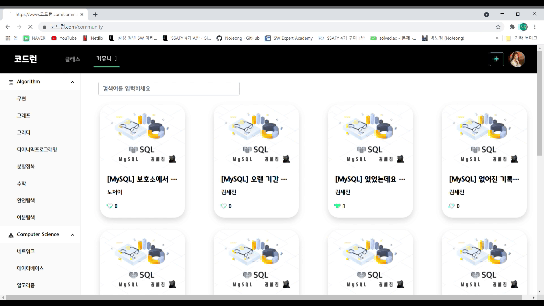
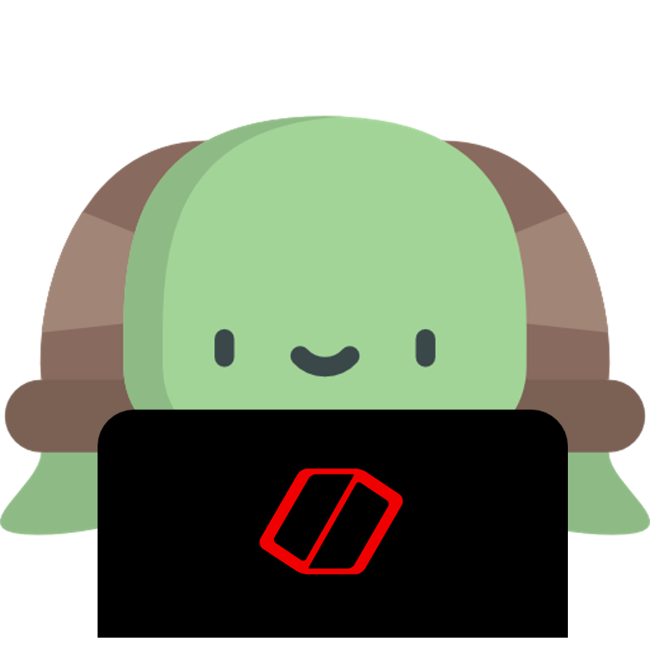

    <h3 style="text-align: center;">
        코딩 스터디 동영상 공유 플랫폼
    </h3>
    <a href="./exec/deploy.md" style="text-align: center;">
        배포방법
    </a>

---

  
Table of Contents

  <ol>
    <li>
      <a href="#코드런이란?">코드런이란?</a>
      <ul>
        <li><a href="#기획-배경-및-전망"> 기획 배경 및 전망 </a></li>
        <li><a href="#기술-스택"> 기술 스택 </a></li>
        <li><a href="#DB-설계"> DB 설계 </a></li>
        <li><a href="#인프라-구조"> 인프라 구조 </a></li>
      </ul>
    </li>
    <li><a href="#서비스-설명">서비스 설명</a></li>
    <li><a href="#팀원소개">팀원소개</a></li>
    <li><a href="#그-밖에...">그 밖에...</a>
      <ul>
        <li><a href="#회고록"> 회고록 </a></li>
        <li><a href="#이미지"> 이미지 </a></li>
        <li><a href="#동영상"> 동영상 </a></li>
        <li><a href="#발표자료"> 발표자료 </a></li>
      </ul>
    </li>
  </ol>

## 코드런이란?

코딩 스터디 동영상 공유 플랫폼

### 기획 배경 및 전망

* 기술/트렌드 동향

  ​	최근 코로나 19 영향으로 재택 근무가 늘어나고 IT 기술의 중요성이 더 높아지고 있다. 그래서 휴대폰이나 컴퓨터로 흔하게 코딩 관련 온라인 클래스를 많이 볼 수 잇다. 주로 현업에 종사하는 현직자나 교수가 주제를 잡고 관련 내용에 대해 강의를 제작하고 수강생이 구입하여 공부하는 형식이 많은 부분을 차지한다.

  ​	많은 양의 강의는 선택권이 많아졌다는 장점이 있지만 반대로 수강생의 입장에서 어떤 강의가 좋은지 확인하기 힘들고 주도적 학습보다 주입식 학습이 이루어진다는 단점이 있다. 그래서 주변에 흔한 취준생이나 직무를 변경하기 위해 IT를 배우는 사람들은 수업외에 스터디를 구성하여 추가적으로 공부를 진행한다. 여러 IT 공부 중 알고리즘이나 CS 지식은 주로 블로그에 작성된 글로 정적으로 공부하고 지식을 공유하는 아쉬움이 있다. 처음 컴퓨터공학 이론을 접하는 이용자에게는 어렵게 다가온다. 전문가는 아니지만 많은 경험을 통해 알고리즘 및 CS 지식을 익히고 있는 취준생이나 학생들이 동영상을 제작해 비슷한 세대와 같이 지식을 동영상이라는 매개체로 공유하면 어떨까 라는 생각으로 시작하게 되었다.

* 국내/외 현황

  ​	국내 서비스로는 대표적으로 온라인 클래스 '인프런'이나 '코드잇' 등 많은 온라인 클래스 플랫폼이 있다. MOOC라는 세계 명문 대학의 강의를 무료로 수강할 수 있는 서비스도 있다. 최근 인프런은 현재 1,000여 개 이상의 IT 분야 온라인 강의 콘텐츠를 수강할 수 있을 뿐 아니라 월 거래액 10억원을 돌파하였다. 코드잇은 지난 2017년 설립된스타트업으로, 지난해 4월 20억 원 규모의 시리즈A 투자를 유치하며 현재는 1.2만명 이상이 유료 구독 중이다.

  

  ​	하지만 대부분 사이트는 이미 현업에서 종사하거나 교수가 전문적인 지식을 전달하는 형태로 이루어진다. 개별적으로 개인이 모르는 점을 남기지 않으면 검색엔진을 활용해서 찾아야하는 단점이 있다.

* 벤치마킹 또는 유사 서비스 사례 소개

  ​	스타링크에서 제공하는 "백준 온라인 저지"를 대표적인 유사 사례로 들 수 있다. 이는 14,000 여개의 알고리즘 문제를 67가지 프로그래밍 언어로 채점받을 수 있는 사이트이다. 뿐만 아니라 다양한 질문과 답변이 오가는 게시판과 팀 스터디를 할 수 있는 스터디 그룹 서비스를 제공하여 프로그램이 대회 준비와 알고리즘 문제 풀이에 대한 문턱을 조금 더 낮추고 있다.

  ​	하지만 문제 해설 강의는 오프라인으로만 제공하는 문제점이 있다. 온라인 문제 해설 강의는 저자 백준을 비롯한 다양한 유튜버들에 의해 유튜브에서 진행되는 경우가 많다.

* 소비자/시장에 줄 수 있는 가치

  ​	코딩은 주로 문제해결을 하기 위해 사용됩니다. 문제 해결을 하고난 뒤 성취감은 엄청납니다. 하지만 단순히 문제해결만을 위해 코딩하는 것이 아니라 내가 만든 코드로 다른 사람들에게 도움을 줄 수 있다면 더 풍족한 보상을 얻게 될 것입니다. 스터디 형식으로 누구나 코딩 동영상 강의를 업로드 할 수 있고 원하는 동영상을 볼 수 있습니다. 그러므로 누구나 지식전파자가 되어 동무이 필요한 사람을 도와줄 수 있으며 어려운 문제는 손쉽게 동영상강의를 통해 도움을 받을 수 있는 서비스를 제공 할 수 있습니다.

  ​	따라서 동영상 플랫폼을 통해 동영상을 올림으로써 누구나 수비게 지식전파자가 될 수 있기 때문에 코딩을 할 때 단순 코딩 그 이상의 가치를 실현할 수 있습니다.

* 향후 전망

  ​	알고리즘 부분에서 백준의 Q&A 시스템을 대체할 수 있을 뿐만 아니라, 백준 Slack의 대안점이 될 수 있으며 서브 서비스로 활용가능하다. 또한, 구축된 시스템 및 서비스를 기반으로 다양한분야의 스터디 동영상 공유 플랫폼을 구성할 수 있다.

## 기술스택

## DB 설계

## 인프라 구조

## 시작방법

### 사전 설치

> 프로젝트를 정상적으로 실행하기 위해선 아래 프로그램들이 설치되어 있어야 합니다

- node.js 14.15.0
- python 3.8.5
- react 17.0.1
- npm 6.14.8
- mysql 8.0.23
- fastapi 0.63.0

### 준비하기

1. Git clone 받기

2. 백엔드 가상환경 설정

   `pip install -r requirements.txt`

3. 프론트엔드 필요 패키지 설치

   `npm i`

4. `.env`파일 작성 (위 프로젝트에는 env파일이 삭제되어 있습니다.)

### 실행하기

1. 백엔드 실행

   로컬에서 하기 위해서는 python main.py로 실행

   도커 실행은 `docker run 옵션`을 통해 실행

2. 프론트엔드 실행

   로컬에서 실행은 `npm start`

   도커는 build 후 빌드 파일을 `docker run 옵션`을 통해 실행

※ 둘 다 도커파일은 작성되어 있습니다.

### 배포하기

해당 서비스는 AWS EC2를 통해 배포하였고 Docker와 Jenkins를 이용해 CI/CD 구축하였습니다:

1. AWS EC2 인스턴스 생성 (ubuntu)
2. docker 설치
3. 필요한 이미지를 docker hub를 통해 이미지 설치 및 컨테이너 생성
   1. Jenkins
   2. MySQL
4. Jenkins와 Gitlab repository 연동
5. 각 폴더 안에 dockerfile 작성
6. fileserver를 도커 네트워크를 통해 생성
7. auto crawler 컨테이너 생성
8. Nginx 설정 (frontend/nginx 폴더의 homepage.conf)
   - fileserver, mlserver, frontend, backend를 nginx로 연결
9. 프로젝트 root 위치에 Jenkins 파일 작성
   1. Build and Test 과정
   2. Build (frontend, backend, mlserver)
   3. Run (컨테이너 실행)
10. `docker ps` 를 통해 7개의 컨테이너 잘 실행되는 것을 확인

## 서비스 설명

* 메인 페이지

  > 간단한 서비스 설명과 함께 가장 많은 추천을 받은 영상들을 Carousel로 보여줍니다.

*  로그인 및 회원가입 페이지

  > 회원가입은 E-mail 인증을 통해 가입을 할 수 있습니다.
  >
  > client에서 SHA256을 통해 한번 암호화를 해주고 server에서 한번 더 SHA256 암호화를 거친 후 데이터베이스에 계정 정보를 저장해 보안을 강화하였습니다.

  

* 메인페이지 (클래스 - 필터)

  > 알고리즘 혹은 Computer Science별로 원하는 강의를 필터링 해서 볼 수 있습니다.
  >
  > 또한, 프로그래밍 언어별로 원하는 언어의 강의를 선택할 수 있습니다.

  

*  메인페이지 (클래스 - 검색)

  > 원하는 키워드를 검색하면 해당되는 영상들만 보여줍니다.
  >
  > 검색 범위는 이용자의 이름, 강의 제목, 강의 내용들에 포함된 키워드입니다.

  

* 메인페이지 (클래스 - 페이지 이동)

  > 페이지 하단의 버튼을 통해 페이지를 이동할 수 있습니다. 한 페에지에 최대 12개의 영상을 보여줍니다.

  

*  비디오 상세페이지

  > 상세 페이지로 이동하면 영상을 시청할 수 있습니다.
  >
  > 하트를 눌러 좋아요를 표시할 수 있으며 생성된 재생목록에 영상을 추가할 수 있습니다.
  >
  > 댓글을 남기거나 댓글을 수정할 수 있습니다.

  

*  동영상 업로드

  > 비디오(최대 250MB)와 썸네일을 지정하여 영상을 업로드할 수 있습니다.
  >
  > 영상 분류는 알고리즘 / CS 중 선택해서 올리며 카테고리를 지정해서 올릴 수 있습니다.
  >
  > 영상 업로드가 완료되면 확인할 수 있도록 마이페이지로 이동합니다.

  

*  마이페이지

  > 마이페이지에서 올린 영상, 재생 목록, 채택된 답변 수 를 확인할 수 있습니다.
  >
  > 마이 플레이리스트에 키워드를 작성하고 추가 버튼을 클릭해 재생목록을 생성할 수 있습니다. 또한 Go To Watch 버튼을 클릭하면 영상 재생 페이지로 이동합니다.
  >
  > 프로필 이미지 버튼을 통해 프로필 이미지를 변경할 수 있으며 닉네임과 패스워드를 수정할 수 있습니다.

* 재생목록

  > 재생목록에 있는 영상들을 클릭하면 바로 영상재생페이지로 이동합니다.

  

* 지식인

  > 궁금한 것을 질문하고 채택할 수 있는 지식인 게시판 입니다.
  >
  > 검색을 통해 원하는 키워드를 검색할 수 있으며 답변이 마음에 드는 경우 채택하기 버튼을 클릭할 수 있습니다.

  

## 팀원소개

* 구태완 - Team Leader, BackEnd, JIRA
* 권세진 - BackEnd, DataBase
* 박노정 - FrontEnd, UCC
* 이경연 - FrontEnd
* 정예림 - FrontEnd, Notion

## 그 밖에...

### 회고록

- <a href="./docs/review/Gu.md">태완's 리뷰</a>
- <a href="./docs/review/Kwon.md">세진's 리뷰</a>
- <a href="./docs/review/Park.md">노정's 리뷰</a>
- <a href="./docs/review/Lee.md">경연's 리뷰</a>
- <a href="./docs/review/Jeong.md">예림's 리뷰</a>

### 이미지

* <a href="./docs/image">이미지 폴더</a>

- 프로필 기본이미지

  - 첫 번째

    

  * 두 번째

    
  
  * 세 번쨰 (**최종 선정된 프로필 기본이미지**)
  
    
  
- 비디오 업로드 완료 이미지

  - 

- 마이 플레이리스트 카드 배경이미지

  

- 메인페이지 배경이미지

  

- 커뮤니티

  - 채택된 댓글에 표시되는 아이콘

    

- 클래스 썸네일 이미지

  

### 동영상

* <a href="https://youtu.be/L3Ybs6dHkFg">동영상 링크</a>

### 발표자료

- <a href="./docs/presentation/코드런_프로젝트계획서.pdf">프로젝트계획서.pdf</a>
- <a href="./docs/presentation/구미1반_D102_발표자료.pdf">최종발표자료.pdf</a>
- <a href="./docs/presentation/구미1반_D102_발표자료.pptx">최종발표자료.pptx</a>

